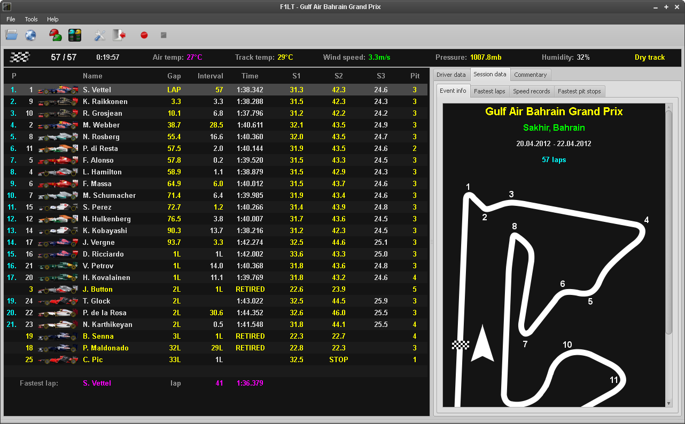
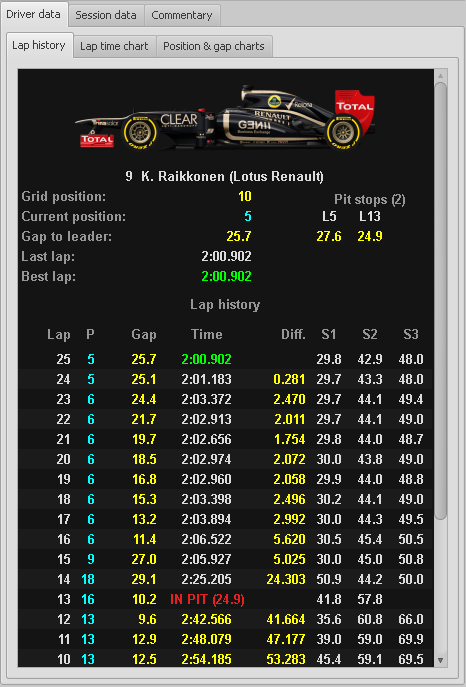
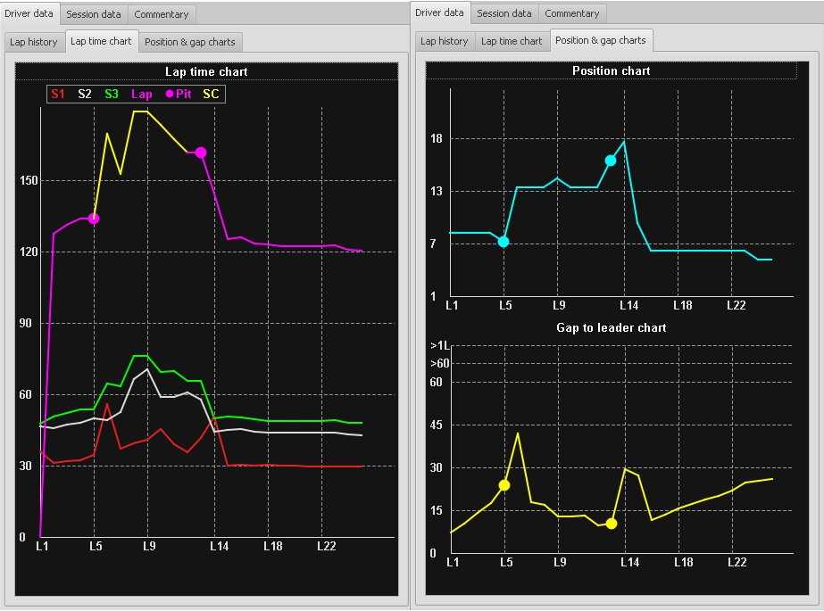
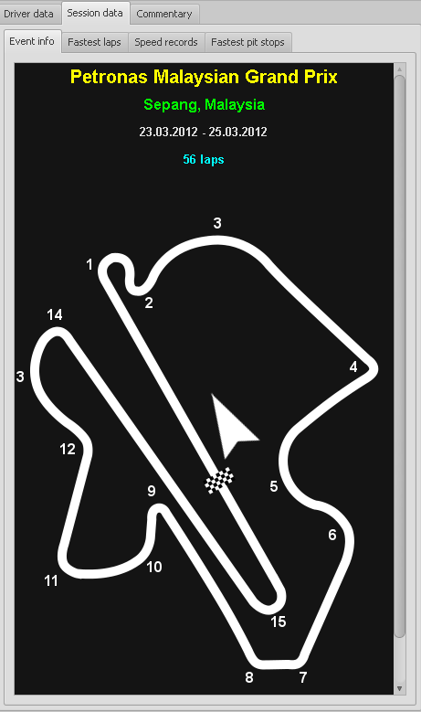
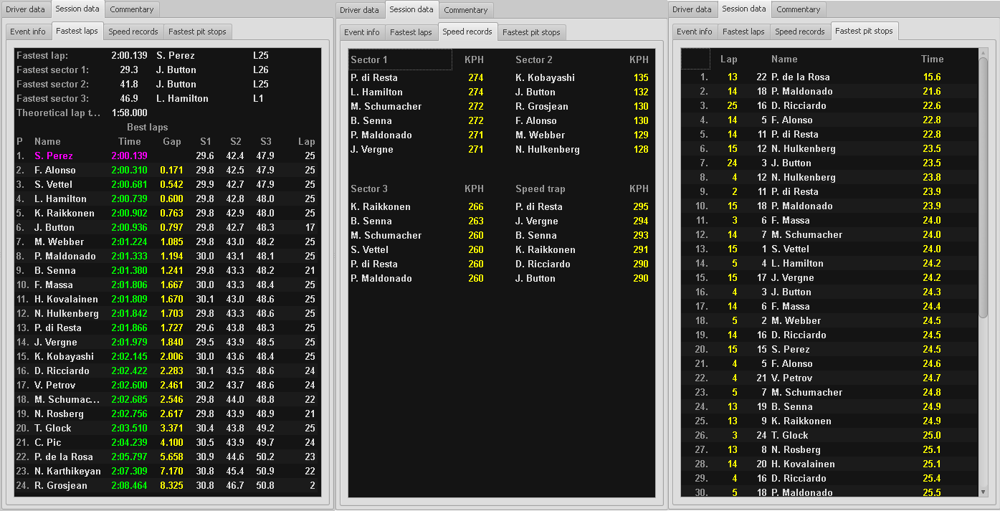
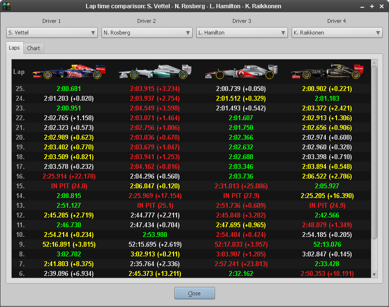
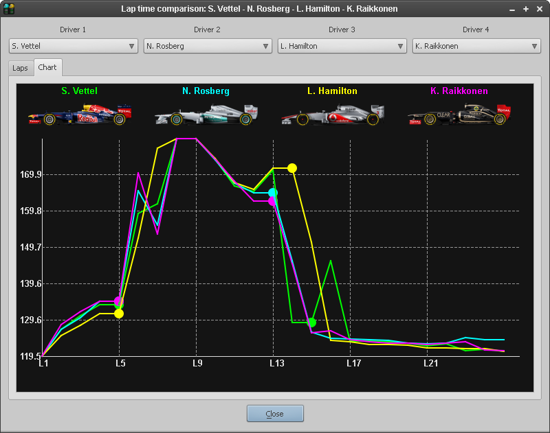
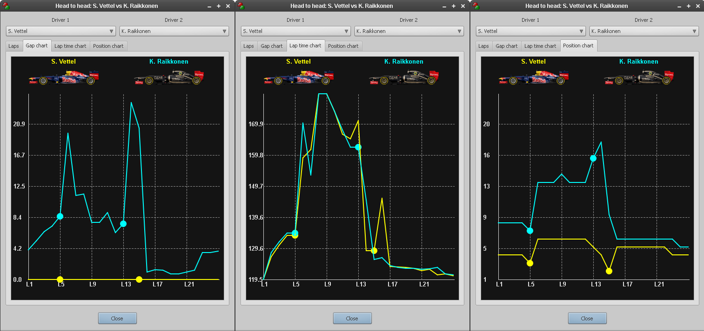
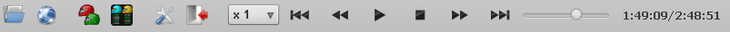

<!DOCTYPE html PUBLIC "-//W3C//DTD XHTML 1.0 Strict//EN"
        "http://www.w3.org/TR/xhtml1/DTD/xhtml1-strict.dtd">
<html xmlns="http://www.w3.org/1999/xhtml" xml:lang="en" lang="en">

<head>
        <title>F1LT - Formula 1 live timing application</title>
        <meta http-equiv="content-type" content="text/html;charset=utf-8" />        
        <link type="text/css" rel="stylesheet" href="doc/stylesheet.css"/>
</head>
<body>
         <b>F1LT</b> is a Formula 1 live timing application written using Qt library for Windows and Linux systems. It is an alternative application to the java applet available on formula1.com site. To use the application you only need an account on formula1.com site, which is used to login into the live timing server and obtain the data. 
          
        Main features of the application:
        <ul>
                <li>gathering all live timing data - you can see lap time history of every driver,</li>
                <li>session statistics - fastest laps, fastest pit stops, speed records, charts,</li>
                <li>lap time comparison tool - allows you to compare lap times of up to 4 drivers at once,</li>
                <li>head to head tool - a driver tracking tool - select two drivers and program will be calculating the gap between them, showing the differences between lap and sector times and drawing charts on every lap,</li>
                <li>recording and replaying live timing - every session can be recorded and played later, very usefull tool when watching a replay of the race.</li>
        </ul>
        
        <h3>The application window</h3>
        Main window of the application is presented on Fig. 1. We can see three panels there - the live timing data is presented on the left panel, while the right panel contains many additional informations, which include:
        <ul>
                <li>driver info tab: lap history with charts</li>                
                <li>basic informations about current event</li>
                <li>session statistics:</li>
                        <ul>
                                <li>fastest laps</li>
                                <li>speed records</li>
                                <li>fastest pit stops</li>
                        </ul>
                <li>session commentary</li>
        </ul>
        

                 
                Fig. 1. Main window of the F1LT application.
        

        The top panel contains session and weather data.   
        
        Icons on the toolbar:
        <ul>
                <li>open archived LT session,</li>
                <li>connect to the LT server,</li>
                <li>head to head tool,</li>
                <li>lap time comparison tool,</li>
                <li>program preferences,</li>
                <li>exit,</li>
                <li>start recording the session,</li>
                <li>stop recording.</li>
        </ul>
        
        <h3>The live timing panel</h3>
        This is the main panel where the current live timing data is shown. This is basically the same what you can see using the formula1.com applet, so there isn't much to explain. Meaning of the colors:
        <ul>
                <li>white - most of the data, no particular meaning,</li>
                <li>green - personal record of the driver</li>
                <li>violet - fastest lap (or sector) of the session</li>
                <li>red - driver is in the pits</li>
                <li>yellow - data from the previous lap/sector</li>
        </ul>
        In addition, during the race, information about the fastest lap is printed at the bottom of the table. During free practice and quali sessions, the 107% time of the session is printed there.
          
        When you select a driver and double-click on his name, his statistics will be shown in the right panel. You can use standard cursor keys, page up-page down, home and end keys to move around the table. Hitting enter will do the same as mouse double-click.
        
        <h3>Top panel</h3>
        Panel contains weather data and session timer. During the race there is also information about completed and total laps. Top left icon correspond to the current flag status (green, yellow, red, safety car, etc.). 
        
        <h3>Driver data tab</h3>
        This tab contains data and statistics of a selected driver. It is splitted into 3 sub-tabs:
        <ul>
                <li>basic driver information and statistics (Fig. 2.)</li>
                <li>lap time chart (Fig. 3.)</li>
                <li>position and gap charts (Fig. 3.)</li>
        </ul>
        

                 
                Fig. 2. Driver lap history tab.
        

        In the driver lap history tab (Fig. 2.) we have all informations about the selected driver - his current position, grid position (completed laps in free practice and quali sessions), gap to leader, best and last lap times, pit stops information and the lap history. Laps are printed in ascending or descending order (this can be set in the preferences). Lap times are coloured:
        <ul>
                <li>white - usuall laps</li>
                <li>yellow - laps behind a safety car</li>
                <li>red - pit stops</li>
                <li>green - driver best lap</li>
                <li>violet - fastest lap of the race</li>
                <li>cyan (free practice and quali only) - if the current lap time is worse than the drivers best, the LT server doesn't send us this time - it is approximated by the program using sector times (lap time is rounded to 0.1 of the second)  </li>
        </ul>
        During free practice and quali the "Gap" column is replaced by the session time when the lap time was set. Moreover, during quali, lap number contains information about the quali period in which lap time was set. 
        Lap history data can be selected and copied to the clipboard - just select what you need and press Ctrl-C.        
        

                 
                Fig. 3. Lap time, position and gap charts.
        

        Three charts are printed in the driver data tab (Fig. 3.):
        <ul>
                <li>lap time chart - contains sector and lap times, laps behind SC are printed in yellow, dots correspond to the pit stops,</li>
                <li>position chart - prints the drivers positions during the session. If you connect to the LT server during the race, server sends the position history, hence this chart always prints driver positions from the start of the race in opposition to other charts which are printed only for gathered data (e.g. when you connect on lap 14, program will start gathering data from that lap onwards). As previously, dots correspond to pit stops,</li>
                <li>gap to the leader chart - so far this works only during the race and free practice. The meaning of dots is as previously.</li>
        </ul>
        Charts can be copied to clipboard or saved to disk in png format - right click on the chart will popup the menu with the appropriate options.
        
        <h3>Session data tab</h3>
        Contains information about the current session:
        <ul>
                <li>event information (Fig. 4.)</li>
                <li>fastest laps (Fig. 5.) - during quali additional information about the quali period in which the time was set is printed</li>
                <li>speed records (Fig. 5.)</li>
                <li>fastest pit stops (Fig. 5.)</li>
        </ul>
        

                 
                Fig. 4. Event information tab.
        

        

                 
                Fig. 5. Fastest laps, speed records and fastest pit stops tabs.
        

        Data printed in fastest laps, speed records and fastest pit stops tabs can be selected and copied to the clipboard by hitting Ctrl-C keys.
        
        <h3>Commentary</h3>
        This tab contains the usuall commentary that appears on the formula1.com site next to the java applet. 
        
        <h3>Lap time comparison tool</h3>
        This tool allows you to select up to 4 drivers and compare their lap times. It is very usefull during the race as you can see your favourite drivers progression in comparison to others. The fastest time on a current lap is printed in green, the second best - in white, then the yellow and red. For example, take a look on Fig. 6. - on lap 25 Vettel was the fastest, Hamilton was second best, Raikkonen was third fastest and the slowest one was Rosberg. As in driver lap history tab, laps can be printed in ascending or descending order - this can be set in program preferences. Data can be selected and copied to clipboard using Ctrl-C key sequence.         
          
        Lap time charts are rather self-explanatory. 
        
          
        The dialog window with lap time comparison is non-modal, therefore you can open it and still have access to the main application window. You can open up to 30 windows with the tool, that gives you a wide range of possible driver comparison combinations.
        
        

                 
                Fig. 6. Lap time comparison tool - main window.
        

        

                 
                Fig. 7. Lap time charts in lap time comparison tool.
        

        
        <h3>Head to head tool</h3>
        This is more advanced version of the lap time comparison tool. It allows you to track two drivers - on every lap program calculates the gap between them and shows the differences between lap and sector times. The better times are printed in green. If SC is on track lap and sector times are printed in yellow. The gap is always calculated as a gap of Driver 1 (in Fig. 8. it is Vettel) to Driver 2 (Raikkonen). Since Vettel was always in front the gap is negative. As in lap time comparison tool, data can be selected and copied to clipboard (Ctrl-C).         
        
        

                 
                Fig. 8. Head to head tool - main window.
        

        

                 
                Fig. 9. Charts in head to head tool.
        

        There are three charts in this tool (Fig. 9.) - lap time and position charts are rather self-explanatory. In the gap chart, the driver that is in front is always printed in 0. If Raikkonen would pass Vettel, his chart would be printed in 0 then, while the Vettels one - according to the gap he would have to Raikkonen.
        
        Similar to lap time comparison tool, this dialog window is also non-modal and allows you to open max. 30 windows.
        
        <h3>Live timing recording and playing</h3>
        F1LT allows you to record current session, save to file and play it later. This can be very usefull when you miss a session and want to watch its replay. Saved files are very small - race files takes from 1 to 2 MB of disk space (free practice and quali sessions even less) and therefore can be easy shared on internet. To start recording the session you only need to choose the right option from the menu, or click the red button on toolbar. You can also set an auto-record option in the preferences - in this case recording will start automatically when the session starts. To stop recording you need to press the "Stop" button on toolbar. This automatically saves the recorded file onto the disk, in the <i>ltdata</i> folder. File names are determined using the following template:  
        <code>year-GPno-name-session.lt</code>, e.g:  
        <code>2012-04-bah-race.lt</code> 
        Session can be <code>race</code>, <code>quali</code> or <code>fpX</code>, where <code>X</code> is the free practice number. Actually program doesn't know what is the current free practice number, it saves the subsequent practice sessions as fp1, fp2 and fp3. If you miss free practice 2 for example, free practice 3 will be saved as fp2, etc.
          
        
        Saved live timing sessions can be opened and played - just click the "open" button on toolbar (first from left), select the appropriate file and application will change its state into the "player state". In this state the application is not connected to the LT server, it doesn't even need the internet connection. When you open a .lt file, you will notice the apperance of player controls on the toolbar (Fig. 10.). These controls replace the "Record" and "Stop" buttons, as recording is not active during session playing. 
        

                 
                Fig. 10. Live timing player controls on the toolbar.
        

        Live timing player can be controlled using these buttons:
        <ul>
                <li>playing speed - from x0.5 to x8</li>
                <li>skip to begin</li>
                <li>rewind by 10 seconds</li>
                <li>play/pause</li>
                <li>stop</li>
                <li>fast forward by 10 seconds</li>
                <li>skip to end</li>                
        </ul>
        There is also additional slider to skip to any time in the session (use it carefully as it can consume a lot of processing power). The usage of player is very intuitive - it doesn't differ much from standard media player. All program tools (like head 2 head) are available during playback.   
        
        To stop playing and go back to the standard program mode click "Stop" button or "Connect" - both of these will stop playback and reconnect to the LT server.  
        
        All races from 2012 season are included in the application archive file. I have also many races from 2010 and 2011 - they are avaialble <a href="http://f1lt.googlecode.com/files/lt_10-11.zip">here</a>.  
        
        You can also set .lt files to be always opened using F1LT - double click on any of the .lt files and choose the right path to the application. After this, every time you double click on a .lt file F1LT application will be launched.
        
        <h3>Customizing F1LT</h3>
        Clicking "Preferences" button will open preferences dialog. Here you can choose font which the data is displayed in and a font for the commentary tab. There are also settings for reversing the laps order in lap history, lap time comparison and head to head tools, session auto-recording and alternating row colors in the LT window.
        
        <h3>Known issues and errors</h3>
        This program is still under development and therefore contains many errors. The known issues are:
        <ul>
                <li>sometimes application won't connect to the LT server - restart it,</li>
                <li>when application is launched more than 5 minutes before start of the session, it prints no data and can have problems with connecting to the server,</li>
                <li>data sent by the LT server is encrypted and sometimes the decryption algorithm fails,</li>
                <li>LT server often sends junk data, this could lead to append wrong data in the lap history.</li>                
        </ul>
        
        <h3>Credits</h3>
        This program was written by Mariusz Pilarek. Many thanks to Scott James Remnant and his great live-f1 application - his data protocol description and source code helped me a lot in implementing F1LT. Also thanks to Maiesky from the f1wm.pl forum for the live timing data from 2010, 2011 and 2012 races.  
        
        If you have any questions or requests, please <a href="mailto:pieczaro@gmail.com">contact with me</a>.
</body>

</html>
